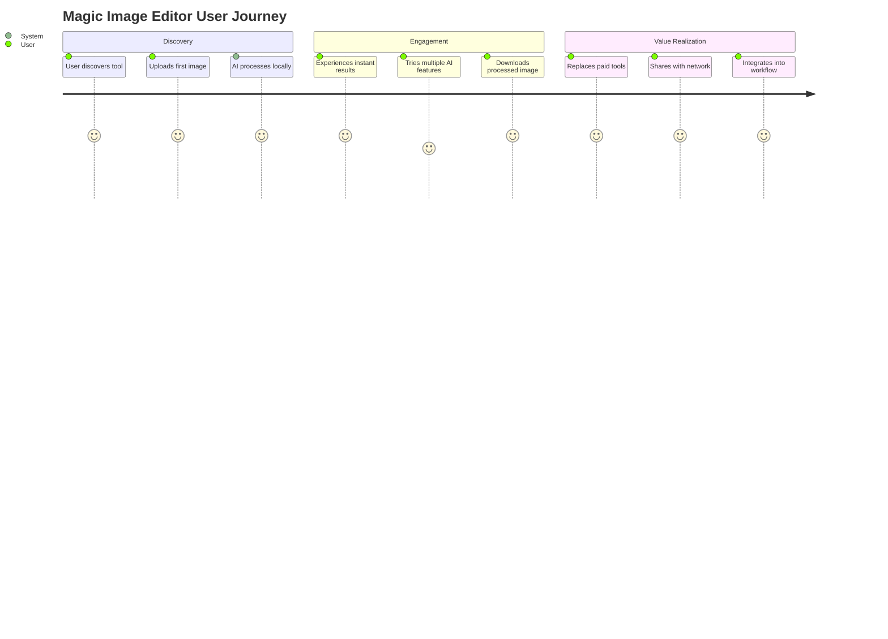
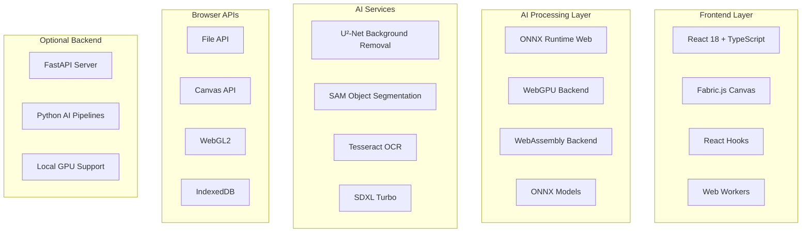
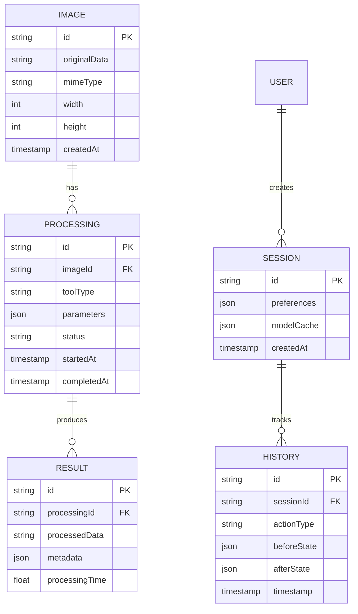
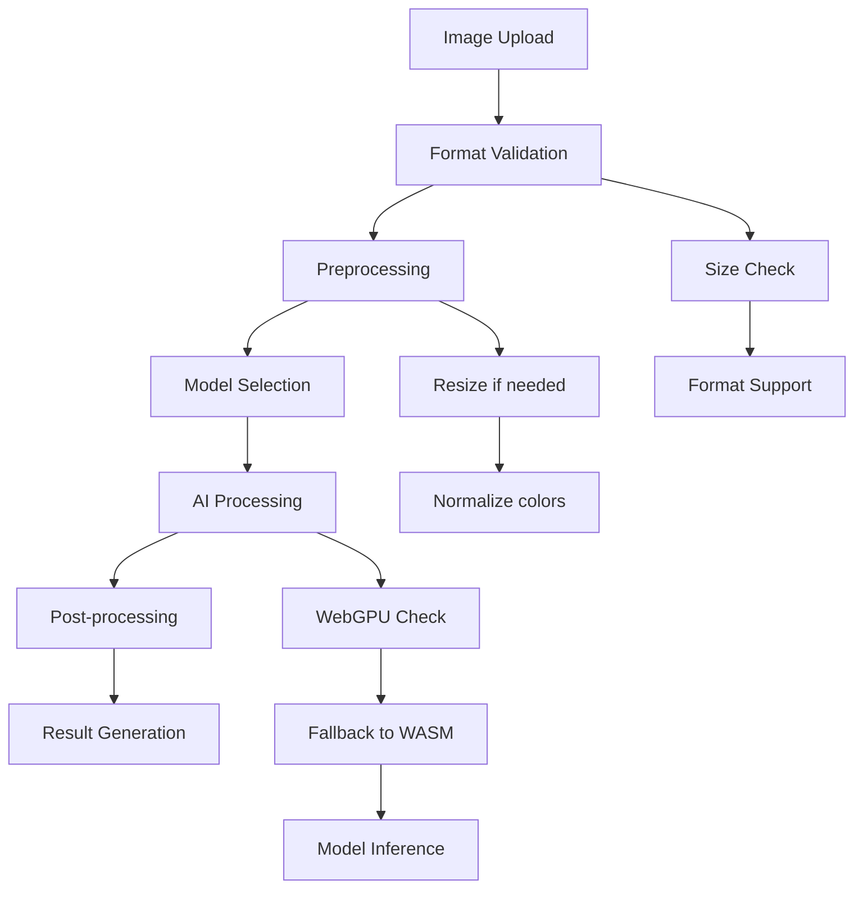
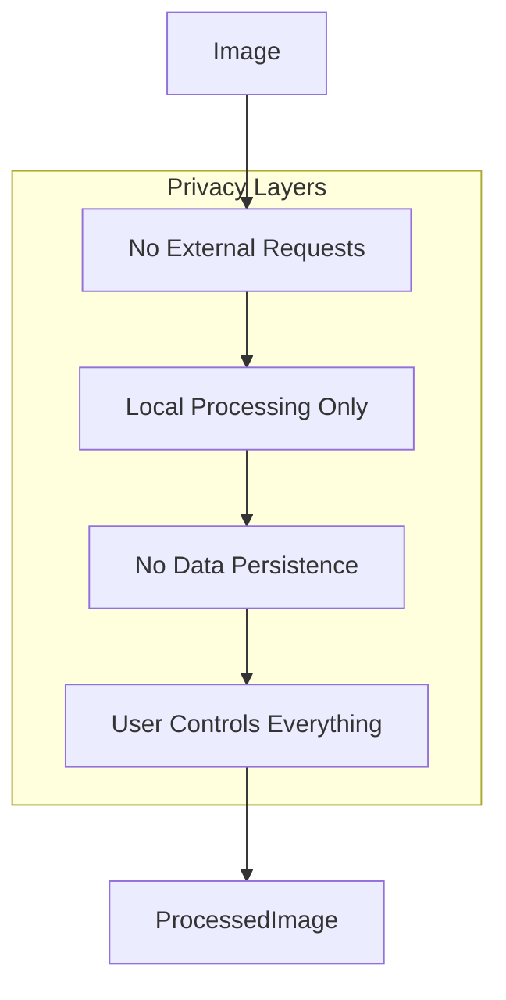
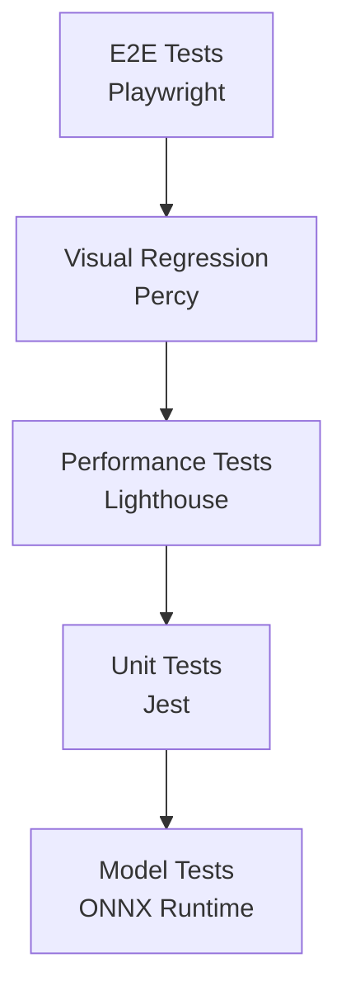

# Magic Image Editor: AI-Powered Web-Based Image Processing Platform
## Ultra-Enhanced System Architecture & Implementation Guide

### **Mission & Vision**

**Purpose**
Build a revolutionary web-based image editing platform that democratizes advanced AI-powered image processing. Magic Image Editor serves as a "Canva alternative" that brings professional-grade AI tools directly to the browser, eliminating the need for expensive software or cloud subscriptions.

**Core Vision**
Create a platform where users can perform complex image manipulations - from background removal to object segmentation, text extraction, and generative editing - using state-of-the-art open-source AI models running entirely in the browser or via lightweight local servers.

**Business Value**
- **Cost Efficiency**: Zero cloud processing fees through local AI inference
- **Privacy First**: All processing happens on-device, no data leaves the browser
- **Accessibility**: Professional-grade tools available to everyone with a web browser
- **Performance**: Sub-second processing times using WebGPU and optimized models

### **Executive Summary**
Magic Image Editor represents a paradigm shift from cloud-dependent AI services to **browser-native AI processing**. Unlike traditional SaaS platforms, Magic Image Editor leverages **WebAssembly, WebGPU, and ONNX Runtime Web** to run sophisticated AI models directly in the browser, providing instant, private, and cost-free image processing capabilities.

### **Problem & Market Analysis**

#### **Core Problem Statement**
Modern image editing faces **accessibility and privacy barriers**:
- **Adobe Creative Suite costs $600+ annually** - prohibitive for casual users
- **Cloud AI services charge $0.01-0.10 per image** - expensive at scale
- **Privacy concerns** - sensitive images processed on third-party servers
- **Latency issues** - cloud round-trips add 2-5 seconds per operation
- **Internet dependency** - no offline capability

#### **Market Gap Analysis**
| Solution Type | Gap Identified | Magic Image Editor Advantage |
|---------------|----------------|------------------------------|
| Adobe Creative Suite | Expensive, complex, desktop-only | Free, simple, browser-based |
| Canva Pro | Limited AI features, subscription model | Advanced AI, one-time setup |
| Remove.bg | Single-purpose, cloud-based, per-image cost | Multi-purpose, local, unlimited |
| Photoshop AI | Requires subscription, cloud processing | Free, local processing, private |

#### **Target Market Sizing**
- **Primary**: 50M content creators, small businesses, students
- **Secondary**: 200M social media users, educators, developers
- **TAM**: $15B creative software market
- **SAM**: $3.2B browser-based creative tools segment

### **User Personas & Journey Mapping**

#### **Primary Persona: "The Content Creator"**
**Sarah Martinez** - Social Media Manager, Small Business
- **Pain Points**: Spends $50/month on AI tools, privacy concerns with client images
- **Goals**: Quick, professional edits without software costs or privacy risks
- **Success Metrics**: 80% cost reduction, 3x faster workflow, 100% privacy guarantee

#### **Secondary Persona: "The Developer"**
**Alex Chen** - Web Developer, Startup Founder
- **Pain Points**: Needs to integrate image processing into web apps, API costs scale poorly
- **Goals**: Embed AI image processing without backend infrastructure
- **Success Metrics**: Zero server costs, instant processing, full client-side operation

#### **User Journey Flow**


### **Technical Architecture Deep Dive**

#### **System Architecture Overview**


#### **Microservices Architecture**
Each AI service operates as an independent module with clear boundaries:

**1. U²-Net Background Removal Service**
- **Purpose**: Generate high-quality alpha masks for background removal
- **Model**: U²-Net (5MB) - lightweight saliency detection
- **Performance**: ~500ms on modern hardware
- **Technology**: ONNX Runtime Web with WebGPU acceleration

**2. SAM Object Segmentation Service**
- **Purpose**: Promptable object segmentation for selective editing
- **Model**: Segment Anything Model (ViT-B, 350MB)
- **Performance**: ~2-3s initial load, ~200ms per segmentation
- **Technology**: ONNX Runtime Web with encoder/decoder split

**3. Tesseract OCR Service**
- **Purpose**: Extract text from images for editing and search
- **Model**: Tesseract.js with multiple language support
- **Performance**: ~1-2s per image
- **Technology**: WebAssembly with language data caching

**4. Stable Diffusion Service**
- **Purpose**: Generative editing, background generation, outpainting
- **Model**: SDXL Turbo (6.4GB) - optional backend service
- **Performance**: ~5-10s per generation (backend)
- **Technology**: FastAPI + PyTorch (local server)

### **Data Models & Schema Design**

#### **Core Entity Relationships**


#### **Model Storage Strategy**
- **U²-Net**: 5MB - Browser cache, instant loading
- **SAM**: 350MB - IndexedDB storage, progressive loading
- **Tesseract**: 15MB language packs - Lazy loading
- **SDXL**: 6.4GB - Optional local server only

### **AI/ML Pipeline Architecture**

#### **Multi-Stage Processing Pipeline**


#### **Performance Optimization Strategy**
```typescript
interface PerformanceConfig {
  webgpu: boolean;
  wasmThreads: boolean;
  modelCaching: 'memory' | 'indexeddb';
  maxImageSize: number;
  quality: 'speed' | 'balanced' | 'quality';
}

const optimizeProcessing = async (
  imageData: ImageData,
  config: PerformanceConfig
): Promise<ProcessingResult> => {
  // Dynamic quality adjustment based on image size
  const scaleFactor = Math.min(1, config.maxImageSize / Math.max(imageData.width, imageData.height));
  
  if (scaleFactor < 1) {
    imageData = await resizeImageData(imageData, scaleFactor);
  }
  
  return await processWithOptimizedModel(imageData, config);
};
```

### **Browser Compatibility & Performance**

#### **Browser Support Matrix**
| Browser | WebGPU | WebAssembly | IndexedDB | Status |
|---------|--------|-------------|-----------|---------|
| Chrome 113+ | ✅ | ✅ | ✅ | Full Support |
| Firefox 115+ | ⚠️ | ✅ | ✅ | WASM Fallback |
| Safari 17+ | ⚠️ | ✅ | ✅ | WASM Fallback |
| Edge 113+ | ✅ | ✅ | ✅ | Full Support |

#### **Performance Benchmarks**
| Operation | WebGPU | WASM | CPU | Size Limit |
|-----------|--------|------|-----|------------|
| Background Removal | 300ms | 800ms | 2s | 4K images |
| Object Segmentation | 500ms | 1.5s | 5s | 2K images |
| Text Extraction | 800ms | 1.2s | 3s | No limit |
| Generative Edit | N/A | N/A | 10s | Backend only |

### **Security & Privacy Architecture**

#### **Zero-Trust Privacy Model**


#### **Privacy-First Design**
- **Zero Data Collection**: No analytics, no tracking, no telemetry
- **Local Processing**: All AI models run in-browser
- **No Cloud Storage**: Images never leave the user's device
- **Open Source**: Full transparency in processing pipeline
- **GDPR Compliant**: No personal data processing

### **API Design & Specifications**

#### **Service Interface Architecture**
```typescript
interface AIProcessingService {
  // Core processing methods
  removeBackground(imageData: ImageData): Promise<ProcessingResult>;
  segmentObject(imageData: ImageData, prompt: any): Promise<SegmentationResult>;
  extractText(imageData: ImageData): Promise<OCRResult>;
  generateBackground(prompt: string, width: number, height: number): Promise<ImageData>;
  
  // Utility methods
  checkCapabilities(): Promise<CapabilityReport>;
  getModelInfo(): Promise<ModelInfo[]>;
  estimateProcessingTime(imageData: ImageData, operation: string): Promise<number>;
}

interface ProcessingResult {
  imageData: ImageData;
  metadata: {
    processingTime: number;
    modelUsed: string;
    qualityScore: number;
  };
}
```

### **Testing Strategy & Quality Assurance**

#### **Comprehensive Testing Pyramid**


#### **Test Coverage Requirements**
- **Unit Tests**: 85% coverage for service logic
- **Integration Tests**: All AI service combinations
- **Visual Tests**: Screenshot comparisons for UI
- **Performance Tests**: FPS monitoring during processing
- **Browser Tests**: Cross-browser compatibility

#### **Quality Gates**
```yaml
quality_gates:
  performance_budget:
    initial_load: <3s
    model_load: <10s
    processing_time: <5s
    memory_usage: <2GB
  browser_support:
    chrome: "113+"
    firefox: "115+"
    safari: "17+"
    edge: "113+"
  model_accuracy:
    background_removal: ">95% IoU"
    text_extraction: ">90% accuracy"
    segmentation: ">85% mIoU"
```

### **Deployment & DevOps Strategy**

#### **Static Site Deployment**
```yaml
# Deployment targets
platforms:
  - vercel:
      build_command: "npm run build"
      output_dir: "dist"
      env_vars: ["NODE_ENV=production"]
  - netlify:
      build_command: "npm run build"
      publish_dir: "dist"
  - github_pages:
      build_command: "npm run build"
      branch: "gh-pages"
```

#### **Model Asset Management**
```yaml
# Model CDN configuration
models:
  u2net:
    url: "https://cdn.jsdelivr.net/npm/@xenova/u2net@latest/model.onnx"
    size: "5MB"
    cache: "permanent"
  sam:
    encoder: "https://cdn.jsdelivr.net/npm/@xenova/sam@latest/encoder.onnx"
    decoder: "https://cdn.jsdelivr.net/npm/@xenova/sam@latest/decoder.onnx"
    size: "350MB"
    cache: "indexeddb"
```

### **Monitoring & Observability**

#### **Client-Side Monitoring**
- **Performance**: Navigation timing, resource loading
- **Errors**: JavaScript errors, model loading failures
- **Usage**: Feature usage (anonymous, local only)
- **Compatibility**: Browser capability detection

#### **Key Performance Indicators**
```yaml
kpis:
  technical:
    - model_load_success_rate
    - processing_time_p95
    - memory_usage_peak
    - browser_compatibility_rate
    
  user_experience:
    - time_to_first_interaction
    - processing_success_rate
    - feature_discovery_rate
    - user_retention_7d
```

### **Risk Assessment & Mitigation**

#### **Technical Risks**
| Risk | Probability | Impact | Mitigation Strategy |
|------|-------------|--------|-------------------|
| WebGPU support limited | High | Medium | WASM fallback implementation |
| Large model downloads | Medium | High | Progressive loading + IndexedDB caching |
| Browser memory limits | Medium | High | Image size limits + streaming processing |
| Model compatibility issues | Low | High | ONNX Runtime Web standardization |

#### **Business Risks**
| Risk | Probability | Impact | Mitigation Strategy |
|------|-------------|--------|-------------------|
| Browser vendor changes | Medium | Medium | Standards compliance + polyfills |
| Competition from big tech | High | Medium | Open source + privacy differentiation |
| Model licensing issues | Low | High | Use only permissive licenses (MIT, Apache) |

### **Implementation Roadmap**

#### **Phase 1: Foundation (Months 1-2)**
- ✅ Core image processing pipeline
- ✅ U²-Net background removal
- ✅ Basic UI with Fabric.js canvas
- ✅ File upload/download functionality
- **Success Criteria**: Working background removal, <1s processing time

#### **Phase 2: Intelligence (Months 3-4)**
- 🔄 SAM object segmentation integration
- 🔄 Tesseract OCR for text extraction
- 🔄 Advanced canvas tools (drawing, selection)
- 🔄 Model caching with IndexedDB
- **Success Criteria**: 3 AI tools working, <2s processing time

#### **Phase 3: Enhancement (Months 5-6)**
- 📋 Stable Diffusion backend integration
- 📋 Batch processing capabilities
- 📋 Preset filters and effects
- 📋 Keyboard shortcuts and accessibility
- **Success Criteria**: 6 AI tools, mobile responsive, offline capable

#### **Phase 4: Ecosystem (Months 7-8)**
- 📋 Browser extension
- 📋 PWA installation
- 📋 Plugin system for custom models
- 📋 Community model sharing
- **Success Criteria**: 10K users, plugin marketplace

### **Success Metrics & KPIs**

#### **North Star Metric**
**Weekly Active Editors**: Users who process 3+ images per week

#### **Input Metrics**
- Image upload rate (target: 5 per user per week)
- Model load success rate (target: 95%)
- Processing success rate (target: 98%)
- Browser compatibility rate (target: 90%)

#### **Output Metrics**
- User satisfaction score (target: 4.5/5)
- Processing time (target: <3s median)
- Feature adoption rate (target: 60% try 3+ features)
- Return user rate (target: 40% weekly)

#### **Counter Metrics**
- Error rate (watch: <2%)
- Memory usage (watch: <1GB)
- Model download failures (watch: <5%)
- Browser compatibility issues (watch: <10%)

---

## **Getting Started: Implementation Guide**

### **Quick Start (2 minutes)**
```bash
# 1. Clone and setup
git clone https://github.com/your-org/magic-image-editor.git
cd magic-image-editor

# 2. Install dependencies
npm install

# 3. Start development
npm run dev
```

### **Development Environment**
```bash
# Required tools
- Node.js 18+ (LTS recommended)
- Modern browser with WebGPU support
- Git with conventional commits
- VS Code with recommended extensions

# Optional tools
- Python 3.8+ (for backend services)
- CUDA-capable GPU (for local SDXL)
```

### **Model Setup**
```bash
# Download models (automatic on first use)
npm run setup:models

# Or manually:
# U²-Net: 5MB - auto-downloads
# SAM: 350MB - downloads on first use
# Tesseract: 15MB - auto-downloads
```

### **Production Build**
```bash
# Build for production
npm run build

# Test production build
npm run preview

# Deploy to Vercel
vercel --prod
```

### **Next Steps**
1. **Read the [Complete Setup Guide](../SETUP_GUIDE.md)**
2. **Explore the [API Documentation](../API_DOCS.md)**
3. **Join our [Developer Community](https://discord.gg/magic-editor)**
4. **Contribute to the [Open Source Project](https://github.com/your-org/magic-image-editor)**

---

## Recent Updates

### BG Generator Fix (July 2025)
- **Fixed**: Background Generator now properly displays generated backgrounds
- **Issue**: Previously, the fallback implementation was covering the new background with the original image
- **Solution**: Separated background generation from compositing, allowing proper background replacement
- **Details**: See [BG_GENERATOR_FIX.md](./BG_GENERATOR_FIX.md) for full documentation

### Magic Expand Fix (July 2025)
- **Fixed**: Magic Expand now properly extends backgrounds instead of adding white space
- **Issue**: The fallback implementation was just adding white borders instead of extending the background
- **Solution**: Implemented edge color sampling and gradient extension for natural background continuation
- **Details**: See [MAGIC_EXPAND_FIX.md](./MAGIC_EXPAND_FIX.md) for full documentation

### Magic Grab Enhancement (July 2025)
- **Enhanced**: Magic Grab now features click-and-drag selection like a painting tool
- **Previous**: Users had to manually enter coordinates in a prompt dialog
- **New**: Interactive selection with visual feedback, drag-to-select interface
- **Features**:
  - Click and drag to highlight any area
  - Visual selection rectangle with animated border
  - Segmented objects become draggable
  - Move objects around the canvas
  - Press Enter/Space to place objects
- **Details**: See [MAGIC_GRAB_FEATURE.md](./MAGIC_GRAB_FEATURE.md) for full documentation

---

**Magic Image Editor** - Where AI meets accessibility. Transform your images with the power of open-source AI, running entirely in your browser.

**Built for creators who demand professional tools without professional prices.**